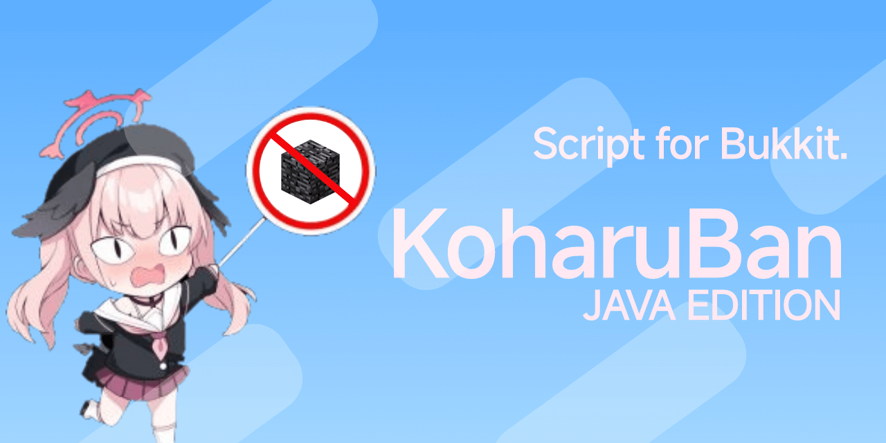

# KoharuBan-Java

## 简介

适用于 Bukkit 及其衍生核心的开源插件。阻止玩家持有指定的非法物品，以及检测并清除非法附魔。

## 从基岩版插件迁移数据

新插件仍未完全实现旧版插件的功能，因此目前还不能进行迁移。这是 [KoharuBan-Lua Repo](https://github.com/daisukiKaffuChino/KoharuBan) ，你可以随时关注动向。

## 测试于

- Paper *1.20.6*
- Minecraft JE *1.20.6*
